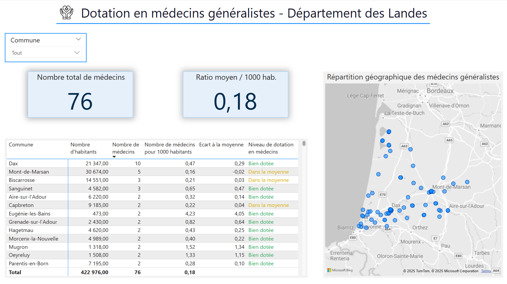

# 👋 Quentin Foux — Data Scientist

Bienvenue sur mon portfolio de projets en data science, data analysis et machine learning.

## 👨‍💻 À propos de moi
Je suis diplômé d’un double master en data science/statistiques et management, avec une expérience en data analysis chez TotalEnergies et en vision par ordinateur dans l’agronomie chez SOWIT. Passionné par les projets à fort impact, je cherche à appliquer mes compétences en ML, visualisation et automatisation.

## 🧠 Projets sélectionnés

### 📊 VizCovidFr  
Visualisation interactive de données relatives à la Covid-19 en France via un package Python — [Voir sur GitHub](https://github.com/quentinfoux/vizcovidfr)  
> Travail collaboratif, gestion de version, visualisation claire via Plotly

### 🦠 Estimation de paramètres pour un modèle épidémique — Chaînes de Markov
Modélisation et simulation d’une chaîne de Markov pour représenter la propagation d’une épidémie, avec estimation des paramètres de transition et étude du temps d’extinction - [Voir sur GitHub](https://github.com/quentinfoux/EpidemioSimu).
> Simulation stochastique, estimation numérique, visualisation des dynamiques épidémiques en fonction de la taille de population.

### 🌾 Étude Départementale - Landes (40)
Analyse territoriale du département des Landes, à travers deux thématiques principales : la santé (médecins généralistes) et l'éducation (présence de CFA – Centres de Formation d’Apprentis) - [Voir sur GitHub](https://github.com/quentinfoux/Etude_Departement_Landes).
> Tableaux de bords interactifs, Power BI, Analyse exploratoire et nettoyage des données

## 📫 Contact  
- quen.foux@gmail.com  
- [Mon URL LinkedIn](https://www.linkedin.com/in/quentin-foux-061484218/)
